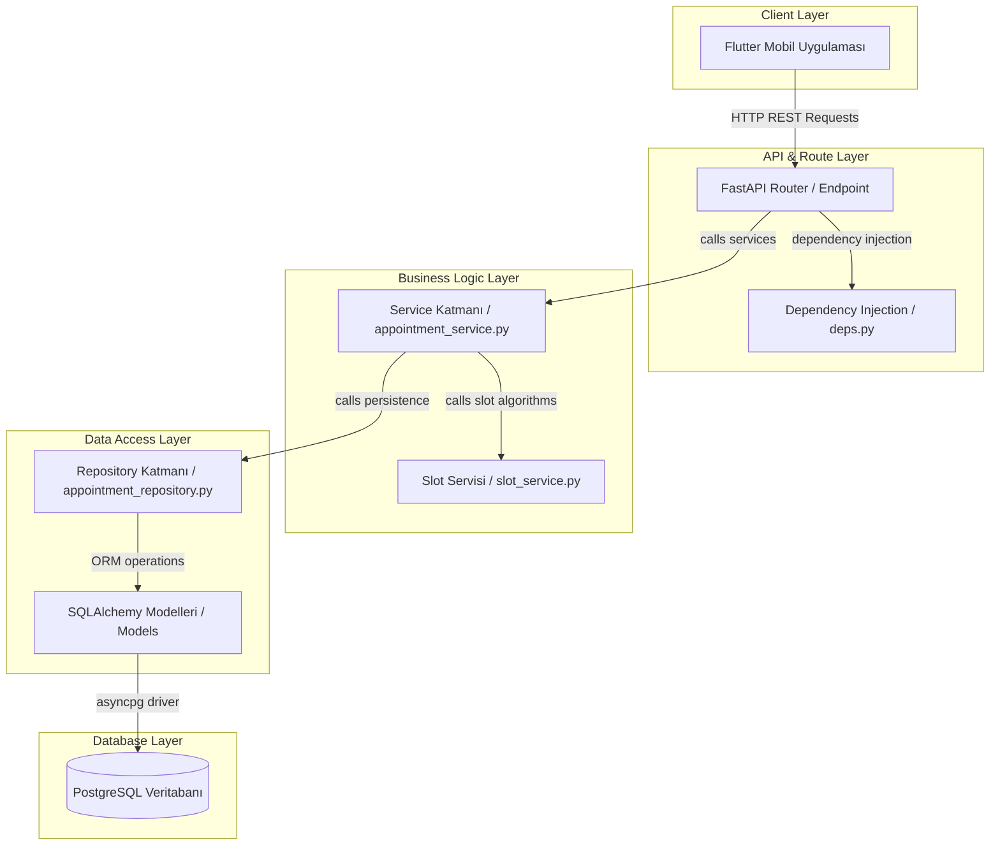
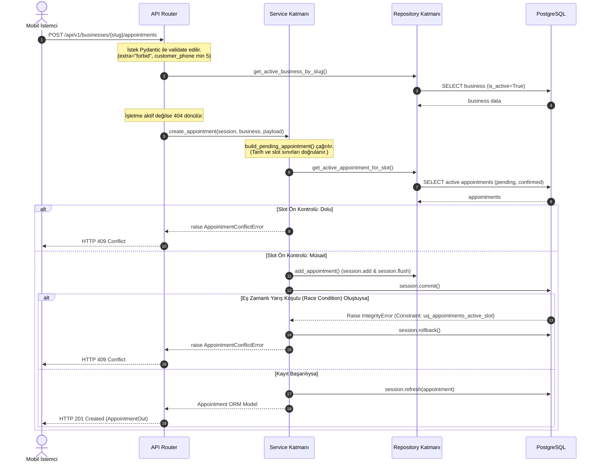

# SıraSende Sistem Mimarisi (02-Architecture.md)

SıraSende platformunun temel yazılım mimarisi; asenkron RESTful backend, ilişkisel veritabanı katmanı ve mobil istemci arasında gevşek bağlı (loosely coupled), ölçeklenebilir ve yüksek performanslı bir yapıda tasarlanmıştır.

---

## 1. Genel Sistem Mimarisi

Sistem, istemci ve sunucu katmanlarının net bir şekilde ayrıldığı (Separation of Concerns) ve veri tutarlılığının veritabanı seviyesinde de korunduğu çok katmanlı (Multi-layered) bir mimariye sahiptir.



---

## 2. Mimari Tasarım Desenleri (Design Patterns)

Backend katmanında veri erişimi, iş mantığı ve sunum katmanlarının temiz bir şekilde ayrıştırılması amacıyla aşağıdaki desenler uygulanmıştır:

### Katmanlı Mimari (Layered Architecture)
Uygulama, bağımlılıkların yalnızca yukarıdan aşağıya doğru aktığı yapısal katmanlardan oluşur:
1.  **Presentation (Router) Katmanı:** FastAPI uç noktalarını (`api/v1/businesses.py`) içerir. Gelen HTTP isteklerini karşılar, Pydantic şemaları ile istek gövdesini doğrular, ilgili servis fonksiyonunu çağırır ve domain hatalarını uygun HTTP durum kodlarına (`201`, `400`, `404`, `409`) dönüştürür.
2.  **Service (Business Logic) Katmanı:** İş mantığının (`app/services/`) işletildiği yerdir. Zaman slotlarının doğrulanması, randevu çakışmalarının önlenmesi ve işlemlerin (transaction) yönetimi burada yapılır.
3.  **Repository (Data Access) Katmanı:** Doğrudan veritabanı sorgularının (`app/repositories/`) yazıldığı katmandır. SQL / SQLAlchemy sorgularını servislerden izole eder.
4.  **Database Models Katmanı:** Veritabanındaki tabloları temsil eden SQLAlchemy ORM nesneleridir.

### Repository Tasarım Deseni
Veri tabanından veri çekme ve veritabanına veri yazma işlemleri asenkron sorgularla repository sınıfları/fonksiyonları içinde yapılır.
*   **Kural:** Repository fonksiyonları asenkron oturum (`AsyncSession`) üzerinde yalnızca veri çekme (`select`), ekleme (`add`) ve senkronize etme (`flush`) işlemlerini yürütür. Kendi başlarına `commit`, `rollback` yapmaz veya domain hatası fırlatmaz.
*   **Amaç:** İş mantığı ile veritabanı sorgularını ayırarak test edilebilirliği artırmak ve veritabanı bağımlılığını kolayca mock'layabilmektir.

### Servis Katmanı & İşlem (Transaction) Sorumluluğu
Veritabanı işlemlerinin (transaction) atomikliği ve veri bütünlüğü servis katmanında yönetilir.
*   **Kural:** `session.commit()` ve hata durumunda `session.rollback()` asenkron çağrıları yalnızca servis katmanında tetiklenir.
*   **Hata Dönüşümü:** Veritabanından fırlatılan ham kısıt ihlali hataları (`IntegrityError`), servis katmanında yakalanarak temiz domain hatalarına (`AppointmentConflictError`) dönüştürülür.

---

## 3. Dinamik Slot Üretim ve Randevu Akışı

Randevu alma süreçleri tamamen asenkron slot hesaplamaları ve veritabanı kısıt doğrulamaları üzerinden ilerler.



---

## 4. Eş Zamanlılık ve Yarış Koşulu Koruması (Concurrency)

SıraSende platformu, aynı zaman dilimine birden fazla aktif randevu oluşturulmasını önlemek için **iyimser kilitleme ve veritabanı seviyesinde kısmi benzersizlik indeksi** (PostgreSQL Partial Unique Index) stratejilerini bir arada kullanır.

### Çift Katmanlı Koruma
1.  **Yazılımsal Ön Kontrol:** Randevu kaydı yapılmadan önce repository seviyesinde `get_active_appointment_for_slot` sorgusu koşturulur. Slot dolu ise işlem hızlıca `409` hatasıyla kesilir.
2.  **Veritabanı Seviyesinde Nihai Güvence:** Ön kontrol ile kayıt (commit) anı arasında geçen sürede başka bir istemcinin aynı slotu alması durumunda (Race Condition), PostgreSQL partial unique index devreye girerek ikinci commit işlemini engeller.

### Kısmi Benzersizlik İndeksi (Partial Unique Index)
İptal edilmiş (`cancelled`) veya tamamlanmış (`completed`) eski randevuların aynı slot için tekrar randevu alınmasını engellememesi amacıyla, benzersizlik kısıtı sadece aktif randevulara uygulanır.

*   **İndeks Adı:** `uq_appointments_active_slot`
*   **İndeks Tanımı (SQL):**
    ```sql
    CREATE UNIQUE INDEX uq_appointments_active_slot 
    ON appointments (business_id, appointment_date, start_time) 
    WHERE status IN ('pending', 'confirmed');
    ```

---

## 5. Altyapı ve Konteynerleşme

Uygulama, yerel geliştirme ve canlıya alma ortamlarının eşitliğini sağlamak için Docker Compose mimarisi üzerine kurulmuştur:

*   **`db` Servisi:** PostgreSQL 16 veritabanını barındırır. Port çakışmalarını önlemek amacıyla host tarafında `5433` portuna map edilmiştir. Verilerin kalıcı olması için `postgres_data` volume'ü tanımlıdır.
*   **`backend` Servisi:** FastAPI uygulamasını barındırır. Docker dosya paylaşımları (bind mounts) sayesinde kod değişiklikleri canlı olarak yansıtılır (reload modu). `db` servisinin sağlıklı (`service_healthy`) duruma gelmesine bağımlıdır.
