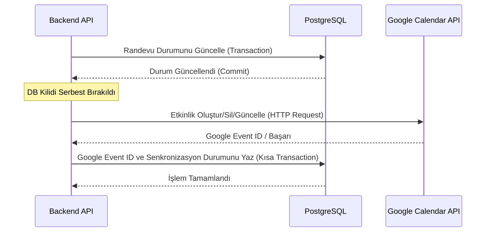

# Google Calendar Sync Entegrasyon Dokümantasyonu

Bu doküman, SıraSende uygulamasının Google Calendar randevu senkronizasyonu altyapısını ve hata yönetim politikalarını detaylandırmaktadır.

## 1. Mimari ve Senkronizasyon Akışı

Senkronizasyon işlemi, veritabanı kilitlerini (database locks) engellemek ve uzun HTTP isteklerinin ana veritabanı işlemlerini geciktirmesini önlemek amacıyla **ana veritabanı transaction'ı tamamlandıktan sonra (commit sonrası)** veritabanı kilidi dışında çalıştırılır.

### Senkronizasyon Durumları (`google_calendar_sync_status`)
- `not_connected`: İşletmenin aktif bir Google bağlantısı bulunmuyor.
- `pending`: Senkronizasyon sıraya alındı veya işlemi devam ediyor.
- `synced`: Google Takvim ile başarıyla senkronize edildi.
- `failed`: Senkronizasyon işlemi bir hata nedeniyle başarısız oldu (hata mesajı `google_calendar_last_error` alanında saklanır).
- `deleted`: Google Takvim'den etkinlik başarıyla silindi.

---

## 2. Hata Yönetimi ve Dayanıklılık (Resilience)

1. **Transaction Bağımsızlığı**: Google Calendar API'sine giden HTTP çağrıları veya OAuth token yenileme işlemleri başarısız olsa bile, randevunun ana veritabanı durum geçişi (örn. Onaylama veya İptal) **asla iptal edilmez**; durum güncellenir ve senkronizasyon durumu `failed` olarak işaretlenir.
2. **404 Idempotency**: İptal edilen bir randevu Google Takvim'den silinmeye çalışıldığında Google API `404 Not Found` hatası dönerse, bu durum idempotent kabul edilir ve işlem başarılı (`deleted`) sayılarak veritabanına yansıtılır.
3. **Mükerrer Kayıt Koruması (Duplicate Protection)**: Yeni bir Google Takvim etkinliği oluşturulmadan önce, `sirasende_appointment_id` extended property alanına göre takvimde arama yapılır. Eğer eşleşen bir event zaten varsa, yeni bir kayıt oluşturulmaz; mevcut event ID eşleştirilir (`synced` olarak kaydedilir).
4. **Token Yenileme ve Yetki İptali**: Access token süresi dolmuşsa arka planda otomatik yenilenir. Google kullanıcısı SıraSende uygulamasının yetkisini iptal etmişse (`invalid_grant` hatası alındığında), veritabanındaki Google bağlantısı otomatik olarak pasife (`is_active = False`) çekilir ve sonraki randevular `not_connected` durumunda bırakılır.

---

## 3. Mobil UI/UX ve Yeniden Senkronizasyon (Retry)

- **Senkronizasyon Durum Göstergesi**: Yönetici ekranlarında randevu kartları altında Google Takvim senkronizasyon durumu dinamik çiplerle gösterilir.
- **Manuel Tekrar Dene**: Başarısız senkronizasyonlarda (`failed`), yöneticiler "Tekrar Dene" butonuyla işlemi tetikleyebilir. Buton tetiklendiğinde double-submit koruması sağlanır (butona tıklama kilitlenir ve loading spinner gösterilir).
